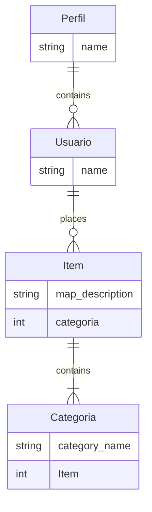

# Trabalho final ProgWeb

### Sobre o projeto
O objetivo desse projeto é desenvolver um web site que servirá para upload e processamento de arquivos no formato raster, as funcionalidades do site consistem hospedar esses site para visualização dos arquivos propriamente ditos e processamento dos mesmos

### Frameworks e tecnologias utilizadas
- **Django**: Utilizado no desenvolvimento do backend da aplicação
- **HTML e CSS**: Utilizado na estruturação e estilização do frontend da aplicação
- **Pillow**: Biblioteca do python responsável por lidar com imagens

### Configuração do Ambiente de desenvolvimento
Siga os passos abaixo para executar o projeto

1. Clone o repositorio na sua maquina `https://github.com/JoaoPedroTS/trabFinalProgWeb.git`

2. Crie um abiente vistualno mesmo diretorio dp codigofonte do projeto `python -m venv <nome do ambiente>`

3. Ative esse ambiente virtual `venv\Scripts\activate`

4. Instale as dependências necessarias para executar o projeto `pip install - r requirements.txt`

5. Execute o projeto `python manage.py runserver`

### Estrutura de pastas do projeto (simplificada)

```console
.
├── item
│   ├──admin.py
│   ├── apps.py
│   ├── forms.py
│   ├──models.py
│   ├── templates
│   │   └── item
│   │       ├── base.html
│   │       ├── delete-item.html
│   │       ├── detail.html
│   │       ├── index.html
│   │       └── item-form.html
│   ├── tests.py
│   ├── urls.py
│   └── views.py
├── manage.py
├── pictures
│   ├── profile_pictures
│   └── profilepic.jpg
├── src
│   ├── asgi.py
│   ├── settings.py
│   ├── static
│   │   └── src
│   │       └── styles.css
│   ├── templates
│   │   └── src
│   │       └── 404.html
│   ├── urls.py
│   ├── views.py
│   └── wsgi.py
└── user
    ├── admin.py
    ├── apps.py
    ├── forms.py
    ├── models.py
    ├── signals.py
    ├── templates
    │   └── user
    │       ├── login.html
    │       ├── logout.html
    │       ├── profile.html
    │       └── register.html
    ├── tests.py
    └── views.py
```

### Descrição da estrutura do arquivo

Após analise de requisito o escopo do projeto foi modelado, seguindo o modelo MVT, utilizando dois aplicativos do Django 
- **Item**
- **User**

### Modelagem banco de dados (simplificada)


### Implementações futuras
Este projeto foi desenvolvido seguido os requisitos da disciplina, entretanto existe espaço para melhorias, que n foram implementadas pois tem uma complexidade maior e demandam mais tempo e esforço, mas são essas:

- Melhoria na estilização
- Funcionalidades de processamento e dos arquivos carregados no site
